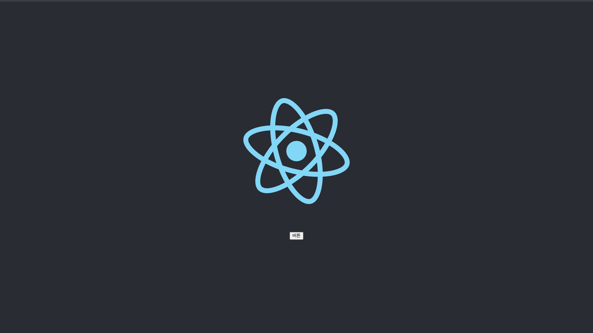
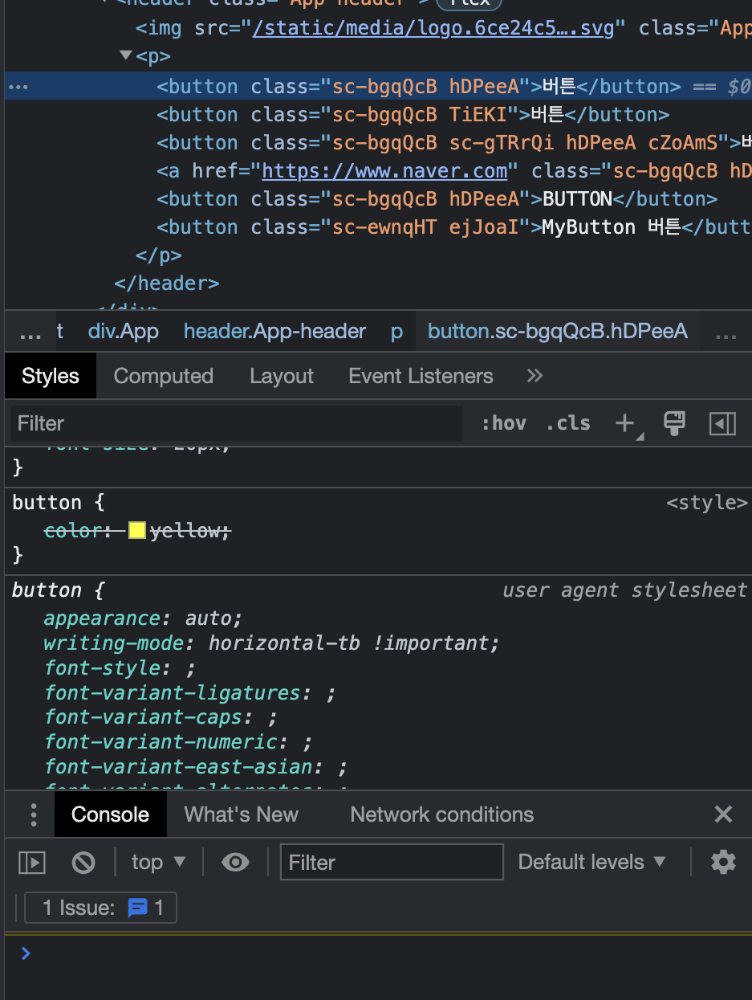

(1) \*\*) \*\* 리액트의 작동 원리와 장점과 단점 정리하기 \*\*

- 장단점을 명확히 알지 못한다면 리액트의 사용 이유를 알 수 없습니다. 사용 이유를 없다면 단연 이를 어렵다고 생각하고 최적화에 대한 깊은 고민이 생기기 마련입니다 :)

- 따라서 각 페어는 리엑트의 작동원리와 이를 통해 얻을 수 있는 장점과 단점을 정리하고 **반드시 그 장점의 예시를 정리**하여 조 내 공유할 수 있도록 해주세요

- 각 페어의 장단점 정리 및 이를 통한 예시는 반드시 깃허브에 브랜치 별 푸쉬할 수 있도록 해주세요 🙂

---

## React의 장단점

장점:

1. 성능: React는 Virtual DOM을 사용하여, 변경된 부분만 실제 DOM에 반영하므로 전체적인 성능을 향상 시킨다.
   (Virtual DOM은 웹페이지와 실제 DOM 사이에서 중간 매개체의 역할을 한다.)

2. 재사용성: React의 컴포넌트 기반 구조는 재사용성을 높여준다. 컴포넌트는 다른 컴포넌트에 중첩하여 사용할 수 있으므로, 코드의 재사용성이 높아진다.
   (따라서 React로 개발을 하다보면 레고 블록을 조립하는 것처럼 컴포넌트들을 조합해서 웹사이트들을 개발하게 되어 코드의 재사용성이 증가한다.)

3. 유지보수: React의 구조는 컴포넌트 단위로 나누어져 있어서, 코드를 유지보수하기 쉽다.

4. 대중성: React는 매우 인기 있는 라이브러리로서, 대부분의 개발자들이 익숙하므로 개발자 커뮤니티에서의 지원과 자료도 많다.

5. React Native: React Native를 활용하여 모바일 환경도 개발할 수 있다는 장점이 있다.
   보통 모바일 앱을 개발하기 위해서는 안드로이드 같은 경우는 코틀린을 IOS는 스위프트를 배워야하는데
   처음으로 모바일 앱개발을 하려는 사람에게는 진입장벽이 높을 수 있는데
   (React Native를 사용하면 JS로 한번 개발해서 안드로이드 앱과 IOS 동시에 만들 수 있다.)

단점:

1. JSX: React는 JSX라는 자체 문법을 사용하는데, 이 문법은 JavaScript와 HTML을 혼합한 것으로 처음 접하는 개발자들에게는 어려울 수 있다.

2. 학습: React는 다른 JavaScript 라이브러리나 프레임워크에 비해 학습곡선이 높다. 따라서 처음 접하는 개발자들은 학습에 시간이 더 걸릴 수 있음.
   (새로운 버전이 계속 나오므로, 새로 공부할 것도 많음 )

3. 부분적인 기능: React는 UI 라이브러리일 뿐이며, 라우팅, HTTP 요청 등의 부분적인 기능은 따로 구현해야 한다. 따라서 프로젝트 규모가 크고 복잡한 경우, 추가적인 라이브러리를 사용해야 할 수 있음.

4. 높은 상태관리 복잡도: React에는 State라는 개념이 존재하는데 이는 컴포넌트의 상태를 의미한다.
   Virtual DOM에서 바뀐 부분만을 찾아서 업데이트 한다고 했는데, 즉 이말은
   State가 바뀐 부분만을 찾는 다는 것이고 React에서 State라는 개념은 굉장히 중요한 개념이다.
   React 에서는 성능 최적화를 하기 위해서는 State를 잘 관리하는 것이 중요한데 이것이 생각보다 어렵다.
   웹사이트의 규모가 커져서 컴포넌트의 개수가 많아지면 상태관리의 복잡도도 증가한다.
   (그래서 보통 큰 규모의 프로젝트의 경우 이러한 상태관리를 위해서
   Redux, Recoil , Mobx 와 같은 상태관리 라이브러리들을사용한다. )

---

**(2) 리액트 예습**

- styleld-components 사용법

  - styled-components 다운로드

  ` npx create-react-app 폴더명 - 폴더로 이동 후 - npm i styled-components`

  - component를 사용할 파일을 만들어 준다. (예시: button component)

  ```jsx
  // 파일명: StyledButton.jsx
  // styled-components 를 import 해준다.
  import styled from "styled-components";

  // 뒤에 `` 안에는 css 문법을 사용해 style을 적용 시킬 수 있다.
  const StyledButton = styled.button``;

  // export default를 통해 내보내준다.
  export default StyledButton;
  ```

  ```javascript
  // 파일명: App.js
  // react 설치시 기본으로 깔리는 App.js에 적용을 해봤다.
  // 적용법: 적용하려는 위치에 <components 파일명>으로 감싼다.
  import logo from "./logo.svg";
  import "./App.css";
  import StyledButton from "./components/StyledButton";

  function App() {
    return (
      <div className="App">
        <header className="App-header">
          
          <p>
            <StyledButton>버튼</StyledButton>
          </p>
        </header>
      </div>
    );
  }

  export default App;
  ```

  npm start를 하고 나서 localhost:3000으로 들어가면 StyledButton을 적용한 화면을 볼 수 있다.

  ### 이미지

    

  위 사진과 같이 버튼이 생긴다.

  개발자 도구로 들어가서 Elements를 찍어보면 StyledButton은 일반 button 태그로 나온다

  ### 이미지

    

  이 button 태그의 특징은 class를 지정하지 않았는데도 class 명이 있고,
  class 명은 sc로 시작하는데 이는 styled-components의 약자이다.

  ## styled-components 작성

  ```jsx
  import styled from "styled-components";

  // `` <- 이 부분에 css 문법을 작성한다.
  const StyledButton = styled.button`
    background: transparent;
  `;

  export default StyledButton;
  ```

  위와 같이 적용을 하게되면 아래와 같은 상태로 변한다.

  ### 이미지

     

  다시 개발자 도구를 보면 style이 head에 스타일로 적용이 되고 그 내용은 component의 class가 자동으로 추가된다.

  styled-components가 겹치지 않게 class를 넣어주고 style도 만들어 관리해준다.

  styled-components에 css 문법을 작성할 때 오타가 나지 않도록 주의해야 한다.
  `` <- 이 부분은 문자열이기 때문에 오타가 나더라도 판별하기 어려움이 있을 수 있다. 또한 ;(세미클론)이 빠지면 style적용이 되질 않기 때문에 주의해야한다.

  ### 예시 이미지

    

  ### 스타일 추가해보기

  ```jsx
  import styled from "styled-components";

  const StyledButton = styled.button`
    background: transparent;
    border-radius: 3px;
    border: 2px solid palevioletred;
    color: palevioletred;
    margin: 0 1em;
    padding: 0.25em 1em;
    font-size: 20px;
  `;

  export default StyledButton;
  ```

  ### 이미지

  

  ## props를 전달해서 props에 맞는 디자인을 보여주는 경우

  StyledButton을 하나 추가하고 props로 priamry를 입력한다.

  StyledButton.jsx로 돌아와 표현식 작성

  ```jsx
  import styled, { css } from "styled-components";

  const StyledButton = styled.button`
    background: transparent;
    border-radius: 3px;
    border: 2px solid palevioletred;
    color: palevioletred;
    margin: 0 1em;
    padding: 0.25em 1em;
    font-size: 20px;

    ${(props) =>
      props.primary &&
      css`
        background: palevioletred;
        color: white;
      `}
  `;

  export default StyledButton;
  ```

  css 문법을 작성하기 때문에 styled에서 css를 import 받아야 하고 앞에 css를 붙여준다.

  ## 완성 이미지

   

### 위 방식을 컴포넌트로 만들기

변수로 PrimaryStyledButton을 하나 만들어주고, styled를 가져온다.
이때 styled는 있는 항목이 아니기 때문에 인자로 StyledButton 받는다.
그 후 똑같이 `` 안에 css 문법 적용

```jsx
const PrimaryStyledButton = styled(StyledButton)`
  background: palevioletred;
  color: white;
`;
```

## 완성 이미지


### style을 만들어 놓고 다른 엘리먼트에 적용을 하고 싶은 경우

만들어 놓은 StyledButton을 다른 태그로 바꿀 수가 있다.

as라는 props에 원하는 태그를 넣어준다.

```jsx
<StyledButton as="a" href="https://www.naver.com">
  버튼
</StyledButton>
```

위 코드는 a 태그를 통해 버튼이 아닌 링크 태그로 만들었다.

## 예시 이미지


as는 특정 엘리먼트를 지칭할 수 있을 뿐만 아니라 특정 컴포넌트도 지칭해서 컴포넌트에 style을 적용할 수 있다.

```jsx
const UpperCaseButton = (props) => (
  <button {...props} children={props.children.toUpperCase()} />
);

<StyledButton as={UpperCaseButton}>button</StyledButton>;
```

UpperCaseButton은 props를 받아 button을 리턴하고 children 안에 toUpperCase 함수를 사용해서 소문자로 쓰여진 button을 대문자로 바꿔준다.

## 예시 이미지


```jsx
const MyButton = (props) => (
  <button className={props.className} children={`MyButton ${props.children}`} />
);

const StyledMyButton = styled(MyButton)`
  background: transparent;
  border-radius: 3px;
  border: 2px solid ${(props) => props.color || "palevioletred"};
  color: palevioletred;
  margin: 0 1em;
  padding: 0.25em 1em;
  font-size: 20px;
`;

<StyledMyButton color="green">버튼</StyledMyButton>;
```

props를 받아오는 위 방식과 달리 class의 이름을 받아오기 때문에 className={props.className}을 사용한다.

css 문법 안에는 미리 만들어놓은 style에서 표현식을 통해 props를 받아준다.

```jsx
   border: 2px solid ${(props) => props.color || "palevioletred"};
```

이 같은 경우는 props로 받아온 color가 없을 경우 default 값으로 "palevioletred"를 적용해주겠다는 뜻이다.

이제 버튼 옆에 porps로 color를 주면 적용이된다.

:hover, ::before와 같은 css 선택자도 사용이 가능하다.

## 예시 이미지


## global로 적용할 때

```jsx
import styled, { createGlobalStyle } from "styled-components";

const GlobalStyle = createGlobalStyle`
button {
  color: yellow
}
`;

<GlobalStyle />;
```

컴포넌트를 생성하고 import 한 createGlobalStyle를 받아와준다
css 속성을 적용하고
적용하고자 하는 위치에 <GlobalStyle />;를 렌더한다.
이름에 맞게 코드 상단에 렌더했지만 위 코드에선 적용이 되지 않는다.
이유는 컴포넌트에서 적용한 속싱이 global 속성보다 우선 순위이 때문

## 이미지



## 어트리뷰트 셋팅

예시로 링크 컴포넌트를 하나 생성한다.

```jsx
const StyledA = styled.a.attrs((props) => ({
  target: "_blank",
}))`
  color: black;
  background-color: white;
`;
<StyledA href="https://www.naver.com">링크</StyledA>;
```

styled를 가져와 점 뒤에 만들고자 하는 태그 입력하고 attrs함수로 props를 받아온 다음 객체로 적용하고자 하는 어트리뷰트를 넣는다.

## 실행 예시


---

# hooks 함수의 종류와 사용 이유

<a href="https://velog.io/@sunhwa508/%EC%9A%B0%EB%A6%AC%EA%B0%80-%EB%A6%AC%EC%95%A1%ED%8A%B8%EC%97%90%EC%84%9C-Hooks-%EB%A5%BC-%EC%82%AC%EC%9A%A9%ED%95%98%EB%8A%94-%EC%9D%B4%EC%9C%A0" target="_blank"> 출처 (우리가 리액트에서 Hooks를 사용하는 이유)</a>

## Hooks의 종류

1. **State Hook**

```jsx
import React, { useState } from "react";

function Example() {
  const [count, setCount] = useState(0);

  return (
    <div>
      <p>You clicked {count} times</p>
      <button onClick={() => setCount(count + 1)}>Click me</button>
    </div>
  );
}
```

- 위 코드에서 보이는 useState가 바로 Hook이다.
- useState는 현재의 state 값과 이 값을 업데이트하는 함수를 쌍으로 제공한다.
- useState() 안에 들어가는 초기값은 첫 번재 렌더링에만 딱 한번 사용된다.

2. **Effect Hook**

```jsx
import React, { useState, useEffect } from "react";

function FriendStatus(props) {
  const [isOnline, setIsOnline] = useState(null);

  function handleStatusChange(status) {
    setIsOnline(status.isOnline);
  }

  useEffect(() => {
    ChatAPI.subscribeToFriendStatus(props.friend.id, handleStatusChange);
    return () => {
      ChatAPI.unsubscribeFromFriendStatus(props.friend.id, handleStatusChange);
    };
  });

  if (isOnline === null) {
    return "Loading...";
  }
  return isOnline ? "Online" : "Offline";
}
```

- useEffect는 함수 컴포넌트 내에서 이런 side effects를 수행할 수 있게 해준다.
- useEffect를 사용하면, React는 DOM을 바꾼 뒤에 "effect" 함수를 실행할 것이다.
- Effect를 "해제"할 필요가 있다면, 해제하는 함수를 반환해주면 된다.
- class 컴포넌트에서는 생명주기 메서드를 사용해 각각 쪼개서 넣어야만 했다면 Hook을 사용하면 코드를 한 군데에 모아서 작성할 수 있게 된다.

3.  **다른 내장 Hook인 useContext, useReducer**

useContext는 컴포넌트를 중첩하지 않고도 React context를 구독할 수 있게 해준다.

4. **이외 기타 hooks**

   1. useCallback

   ```jsx
   const memoizedCallback = useCallback(() => {
     doSomething(a, b);
   }, [a, b]);

   // 1. 매모이제이션된 콜백을 반환한다.
   // 2. 불필요한 렌더링을 방지하기 위해 참조의 동일성에 의존적인 최적화된 자식 컴포넌트에 콜백을 전달할 때 유용하다.
   ```

   2. useMemo

   ```jsx
   const memoizedValue = useMemo(() => computeExpensiveValue(a, b), [a, b]);

   // 1. 메모이제이션된 값을 반환
   // 2. useMemo는 의존성이 변경되었을 때만 메모제이션된 값만 다시 계산하여 모든 렌더링 시 고비용 계산을 방지해 최적화 해준다.
   // 3. useMemo로 전달된 함수는 렌더링 중에 실행된다는 것을 기억하자. 통상적으로 렌더링 중에는 하지 않는 것을 이 함수 내에서 적용하면 안된다.
   ```

   3. useRef

   ```jsx
   function TextInputWithFocusButton() {
     const inputEl = useRef(null);
     const onButtonClick = () => {
       // `current` points to the mounted text input element
       inputEl.current.focus();
     };
     return (
       <>
         <input ref={inputEl} type="text" />
         <button onClick={onButtonClick}>Focus the input</button>
       </>
     );
   }

   // 1. DOM에 접근하는 방법으로 사용된다.
   // 2. useRef()는 순수 자바스크립트 객체를 생성하기 때문에 ref 속성보다 유용하다.
   // 3. 본질적으로 useRef는 .current 프로퍼티에 변경이 가능한 값을 담고 있는 '상자'라고 표현한다.
   ```

   4. uselmperativeHandle

   ```jsx
   function FancyInput(props, ref) {
   const inputRef = useRef();
   useImperativeHandle(ref, () => ({
    focus: () => {
      inputRef.current.focus();
    }
   }));
   return <input ref={inputRef} ... />;
   }
   FancyInput = forwardRef(FancyInput);

   /*
   1. useImperativeHandle은 ref를 사용할 때 부모 컴포넌트에 노출되는 인스턴스 값을 사용자화(customizes)합니다

   2. 예시에서 <FancyInput ref={inputRef} />를 렌더링한 부모 컴포넌트는 inputRef.current.focus()를 호출할 수 있습니다.
    */
   ```

   5. useLayoutEffect

   ```jsx
   /*
   1. 이 함수는 useEffect와 동일하긴 한데, 모든 DOM 변경 후에 동기적으로 발생합니다.
   2. DOM에서 레이아웃을 읽고 동기적으로 리렌더링하는 경우에 사용하세요.
   3.  먼저 useEffect를 사용해 보고 문제가 있다면 그다음으로 useLayoutEffect를 사용해 보기를 권합니다.
   
    */
   ```

   6. useDebugValue

   ```jsx
   function useFriendStatus(friendID) {
     const [isOnline, setIsOnline] = useState(null);

     // ...

     // Show a label in DevTools next to this Hook
     // e.g. "FriendStatus: Online"
     useDebugValue(isOnline ? "Online" : "Offline");

     return isOnline;
   }

   // 1. useDebugValue는 React 개발자도구에서 사용자 Hook 레이블을 표시하는 데에 사용할 수 있다.
   ```

   ## Hooks 사용이유

   1. **컴포넌트 사이에서 생태로직을 재사용하기 어렵다.**

      - Hook을 사용하면 컴포넌트로부터 상태 관련 로직을 추상화할 수 있다.
      - 독립적인 테스트와 재사용이 가능하다.
      - Hook은 계층의 변화 없이 상태 관련 로직을 재사용할 수 있도록 도와준다.

   2. **복잡한 코드를 간단하게 나타낼 수 있다.**

      - Hook을 통해 서로 비슷한 것을 하는 작은 함수의 묶음으로 컴포넌트를 나누는 방법을 사용할 수 있다.

   3. **Class는 혼란을 줄 수 있다.**
      - class 사용을 위해 필수적인 this 키워드가 어떻게 작동하는지 알아야 하기 때문에 사용자들에게 큰 혼란을 주었으며, 코드의 재사용과 구성을 어렵게 만들었다.
      - Hook은 Class 없이 React 기능들을 사용하는 방법을 제시한다.

---

**(3) 리엑트 라우팅 연습과 컴포넌트 나눠보기**

- 리액트의 상태 생테계를 알지 못하면 효율적인 컴포넌트 나누기는 불가능합니다.

- 그러나 유지보수를 기반으로 러프한 기준으로 자유롭게 컴포넌트 분리를 위해

의견을 나눠보세요

- 의견을 나눴다면 혹 사전에 만들었던 퍼블리싱 프로젝트가 있다면 이를 기준으로 컴포넌트 분리 및 라우터 분리, 페이지 이동을 구현해보세요 :)

- 해당 활동의 목표는 react-router-dom의 조작 방법에 익숙해지는 것과 컴포넌트화라는 개념의 숙달입니다.

```

```

asd
